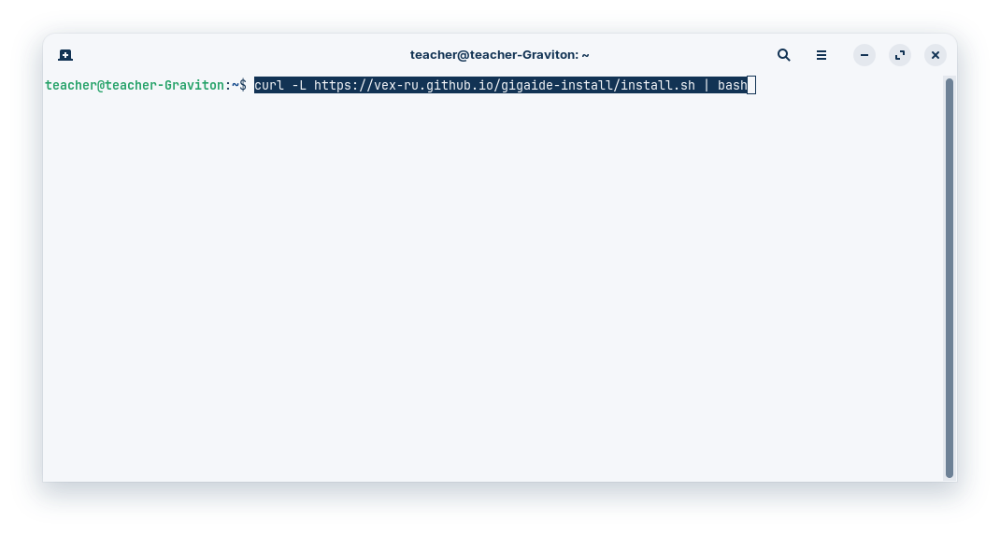
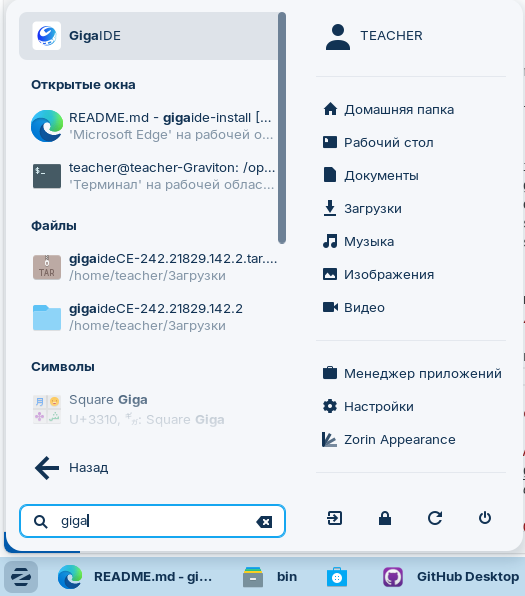

# Установка GigaIDE в Linux одной командой


[](LICENSE)
[](#)

**GigaIDE Install Script** — это официальное решение для быстрой установки GigaIDE на российские операционные системы Astra Linux и RED OS. Наш скрипт разработан специально для преподавателей, обучающих программированию на отечественном программном обеспечении, и разработчиков, работающих в защищенных средах.

> ⚡️ **Установите GigaIDE за 1 клик в терминале (консоли) Linux:**  

> `curl -L https://vex-ru.github.io/gigaide-install/install.sh | bash`



## Почему именно GigaIDE для Astra Linux и RED OS?

В условиях импортозамещения и перехода на отечественные операционные системы, такие как **Astra Linux** и **RED OS**, возникает потребность в современных инструментах разработки, адаптированных под российские стандарты безопасности. GigaIDE — это мощная интегрированная среда разработки, созданная с учетом требований российских образовательных учреждений и предприятий.

### 🔒 Ключевые преимущества для преподавателей и разработчиков

- **Полная поддержка российских ОС**: Тестирование и оптимизация под Astra Linux Special Edition и RED OS
- **Соответствие требованиям информационной безопасности**: Работа в защищенных средах без нарушения политик безопасности
- **Локализация на русский язык**: Интерфейс и документация полностью на русском языке
- **Интеграция с отечественными стандартами**: Поддержка ГОСТов и российских криптопровайдеров
- **Простота установки**: Всего одна команда для полной установки в меню приложений

## 📦 Установка на Astra Linux и RED OS

### Метод 1: Установка через curl (рекомендуется)

```bash
curl -L https://vex-ru.github.io/gigaide-install/install.sh | bash
```

Этот метод:
- Автоматически скачает и установит GigaIDE
- Создаст ярлык в меню приложений
- Установит необходимые зависимости
- Настроит интеграцию с системой

### Метод 2: Ручная установка

1. Скачайте последнюю версию: [gigaideCE-242.21829.142.2.tar.gz](https://gigaide.ru/downloadlast/gigaideCE-242.21829.142.2.tar.gz)
2. Распакуйте архив: `tar -xzf gigaideCE.tar.gz`
3. Переместите в системную директорию: `sudo mv gigaide-CE-242.21829.142.2 /opt/`
4. Создайте файл запуска: `nano ~/.local/share/applications/gigaide.desktop`

```
[Desktop Entry]
Version=1.0
Type=Application
Name=GigaIDE
Comment=Giga IDE
Exec="/opt/gigaide-CE-242.21829.142.2/bin/idea" %f
Icon=/opt/gigaide-CE-242.21829.142.2/bin/idea.png
Categories=Development;IDE;
Terminal=false
StartupWMClass=jetbrains-idea
```

5. Дайте права на выполнение .desktop файла `chmod +x ~/.local/share/applications/idea.desktop`

6. Обновите кэш приложений `update-desktop-database ~/.local/share/applications`

## 🖼️ Скриншоты GigaIDE в Astra Linux





## ❓ Часто задаваемые вопросы

[FAQ - https://gitverse.ru/features/gigaide/#faq](https://gitverse.ru/features/gigaide/#faq)


## 📜 Лицензия

Этот проект лицензирован по лицензии MIT - подробности в файле [LICENSE](LICENSE).

---

**Ключевые слова для поисковых систем:**  
GigaIDE установка Astra Linux, GigaIDE RED OS, IDE для российских операционных систем, установка GigaIDE без терминала, GigaIDE для преподавателей, отечественное ПО для программирования, установка IDE в меню приложений Astra Linux, GigaIDE образовательная лицензия, JetBrains альтернатива в России, установка GigaIDE одной командой, скрипт установки GigaIDE, GigaIDE русская версия, программирование на отечественных ОС, разработка ПО в Astra Linux, интегрированная среда разработки для RED OS, GigaIDE учебная версия, методические материалы по GigaIDE

**Категории:**  
Разработка ПО, Образование, Отечественное ПО, Astra Linux, RED OS, Программирование, Инструменты разработчика, Импортозамещение
